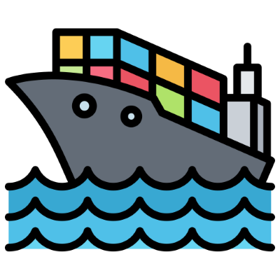

# COM_APP

<p align="center">
  
</p>


## 📋 Description

**COM_APP** is an enterprise Flutter application for material order management and control. It enables users to manage contracts, budgets, purchase orders, and track inventory and costs in real-time.

## ✨ Key Features

- 🔐 **Secure authentication** with Firebase Auth
- 📊 **Interactive dashboard** with data visualization
- 📦 **Order management** for purchases and materials
- 💰 **Budget and cost control**
- 📈 **Reports and analytics**
- 🔄 **Real-time synchronization** with Supabase
- 📧 **Email notification system**
- 🌐 **Multi-platform support** (Web, Android)

## 🛠️ Tech Stack

| Technology | Usage |
|------------|-------|
| **Flutter 3.x** | Development framework |
| **Dart 3.x** | Programming language |
| **Firebase** | Authentication and hosting |
| **Supabase** | Database and APIs |
| **Google Apps Script** | Backend APIs |
| **BLoC** | State management |

## 📁 Project Architecture

```
lib/
├── bloc/                 # Global state with BLoC
├── budget/               # Budget module
├── contrato/             # Contract module
├── home/                 # Home page
├── login/                # Authentication
├── resources/            # Shared resources
│   ├── constants/        # Constants and configuration
│   └── env_config.dart   # Environment variables
├── firebase_options.dart # Firebase configuration
└── main.dart             # Entry point
```

## 🚀 Installation

### Prerequisites

- Flutter SDK 3.7.2 or higher
- Dart SDK 3.x
- A Firebase account
- A Supabase account (optional)
- Git

### Installation Steps

1. **Clone the repository**
   ```bash
   git clone https://github.com/jozzer182/COM_APP.git
   cd COM_APP
   ```

2. **Configure environment variables**
   ```bash
   # Copy the example file
   cp .env.example .env
   
   # Edit .env with your credentials
   # See "Environment Variables Configuration" section
   ```

3. **Configure Firebase for Android**
   ```bash
   # Copy the example file
   cp android/app/google-services.json.example android/app/google-services.json
   
   # Replace with your google-services.json from Firebase Console
   ```

4. **Install dependencies**
   ```bash
   flutter pub get
   ```

5. **Run the application**
   ```bash
   # Web
   flutter run -d chrome
   
   # Android
   flutter run -d android
   ```

## ⚙️ Environment Variables Configuration

Create a `.env` file in the project root based on `.env.example`:

### Firebase

```env
# Web
FIREBASE_WEB_API_KEY=your_api_key
FIREBASE_WEB_APP_ID=your_app_id
FIREBASE_WEB_PROJECT_ID=your_project_id
# ... etc

# Android
FIREBASE_ANDROID_API_KEY=your_api_key
# ... etc
```

### Google Apps Script

The APIs use Google Apps Script. You need to deploy your own scripts:

```env
API_FEM=https://script.google.com/macros/s/YOUR_SCRIPT_ID/exec
API_COSTI=https://script.google.com/macros/s/YOUR_SCRIPT_ID/exec
# ... etc
```

### Supabase

```env
SUPABASE_URL=https://your-project.supabase.co
SUPABASE_ANON_KEY=your_anon_key
```

## 📖 Additional Documentation

For detailed configuration instructions, see:
- [docs/SETUP.md](docs/SETUP.md) - Complete setup guide

## 🤝 Contributing

Contributions are welcome. Please:

1. Fork the project
2. Create a branch for your feature (`git checkout -b feature/AmazingFeature`)
3. Commit your changes (`git commit -m 'Add some AmazingFeature'`)
4. Push to the branch (`git push origin feature/AmazingFeature`)
5. Open a Pull Request

## 📄 License

This project is for private/internal use.

## 📬 Contact

**José Zarabanda**

[](https://www.linkedin.com/in/zarabandajose/)
[](https://github.com/jozzer182)
[](https://zarabanda-dev.web.app/)

---

<p align="center">
  Developed with ❤️ using Flutter
</p>
